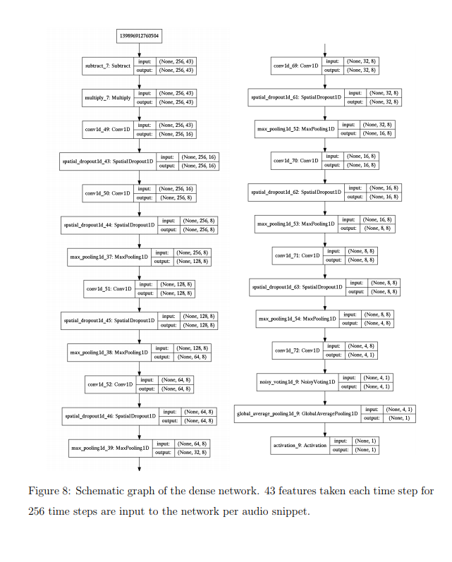
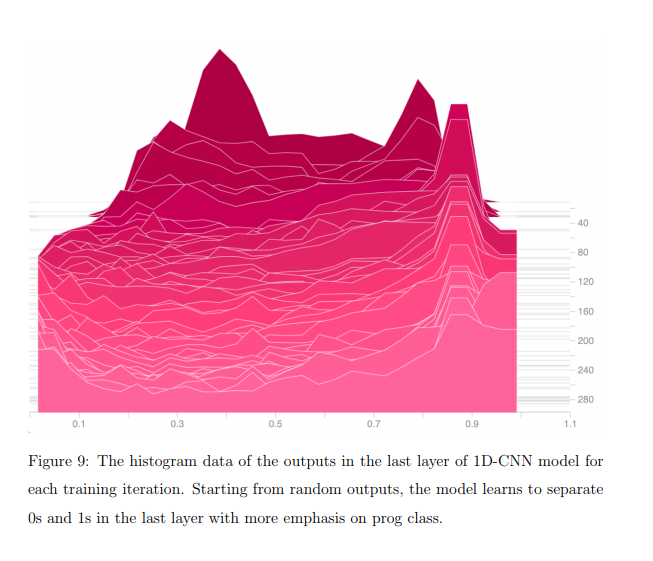
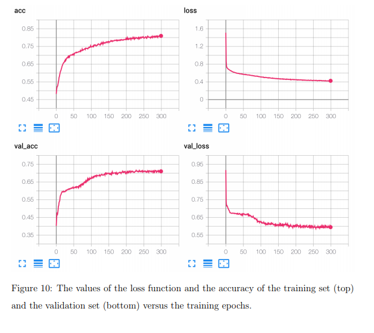
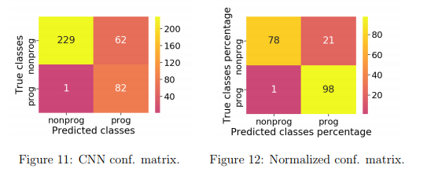

# Music_Genre_Classification
## Progressive Rock Classification
 This project is about creating classifier that distinguishes between progressive and non-progressive rock songs, by using only the audio data without metadata. This is a challenging problem. The distinction between non-progressive and progressive rock can sometimes be subjective and depend on subtle features of the audio, including presence or absence of certain instruments or percussion patterns, and the structure of the song. Furthermore, lyrical elements are extremely difficult to extract from the audio data. Hence, this important feature that sometimes is indicative of the genre is lost to the classifiers.

The training set consisted of 374 songs, labeled as either ”prog” or ”nonprog”. Most of the songs didn’t have metadata with an associated genre, or had a corrupted metadata, so the metadata was not used in any way to evaluate classification accuracy. A similar validation set is used, which is classified accordingly. Both sets were heavily imbalanced with the progressive rock being the minority class, which presented an extra challenge.

## 1D - CNN MODEL 
The model architecture of 1D -CNN is present in the figure.This model starts with trainable feature space normalization
layers, following by a series of convolutional layers, dropouts, and max pooling andit ends by a ”Noisy Voting” layer and an average pooling layer.

## Monitoring the performance 
To avoid overfitting during the training, the values of the model accuracy and loss
functions for both the training and the validation sets were monitored for each epoch
via the TensorBoard visualization utility of the TensorfFlow. The plots for the values
of loss functions and accuracy of the model are included below

##Results 
### Confusion Matrix 
A confusion matrix is a summary of prediction results on a classification problem.
The number of correct and incorrect predictions are summarized with count values and broken down by each class

